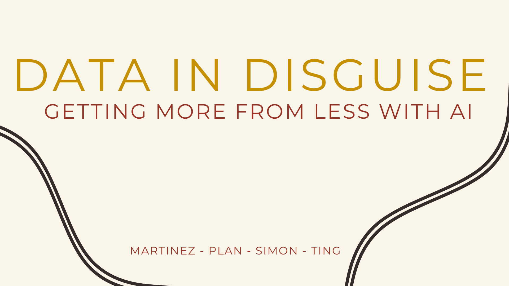
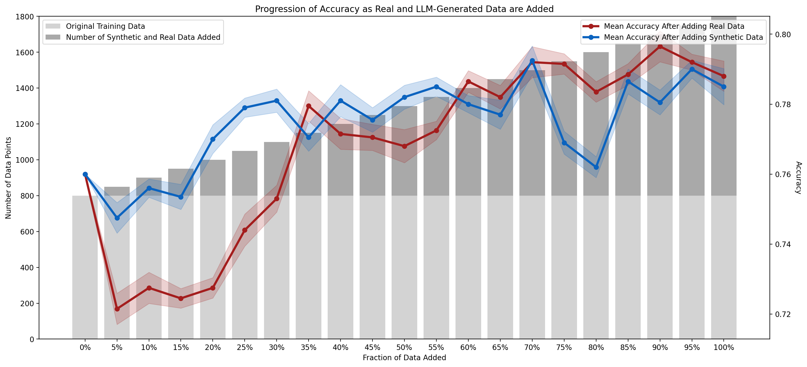

<h1></h1>

<h1>Authors</h1>
Paula Martinez, Christian Plan, Joshua Simon, Nico Ting

<h1>Project Description</h1>
This project addresses the critical challenge of data scarcity in artificial intelligence by developing a proof-of-concept that uses large language models (LLMs) and interpretability techniques to generate high-quality synthetic textual data. With the looming depletion of high-quality language data projected by 2026, our approach utilizes LLMs, such as ChatGPT and Claude, combined with the Shapley Additive Explanations (SHAP) algorithm, to create synthetic datasets that enhance emotion detection models. 

<h1>Key Takeaways</h1>

<ol>
  <li><b>Model Performance Improvement</b>: The study observed that the model's predictive capabilities improved consistently as more data, regardless of its source, was introduced. This supports the well-established principle that a diverse set of training data generally leads to enhanced model performance.</li> 
  <li><b>Equivalence of Synthetic and Real Data</b>: The performance of the model using synthetic data generated by LLMs was almost indistinguishable from that using real data. The model reached a peak accuracy of 78.50% with synthetic data compared to 78.80% with real data, highlighting the effectiveness of synthetic data in mimicking real-world distributions.</li> 
  <li><b>Significance of Synthetic Data Generation</b>: The close alignment between the performance curves for synthetic and real data augmentation suggests that synthetic data generated by LLMs successfully captures essential characteristics and patterns of real data. This finding underscores the potential of LLMs to produce high-quality synthetic data that can serve as a viable substitute for real data in various applications.</li> 
  <li><b>Superiority of Claude.AI<b>: Although not detailed in the excerpt provided, additional information indicates that Claude.AI was more effective than ChatGPT in generating synthetic data. This suggests that Claude.AI might have better capabilities or methodologies for prompt engineering and data generation, tailored specifically for emotion prediction tasks
  </li>
</ol>
